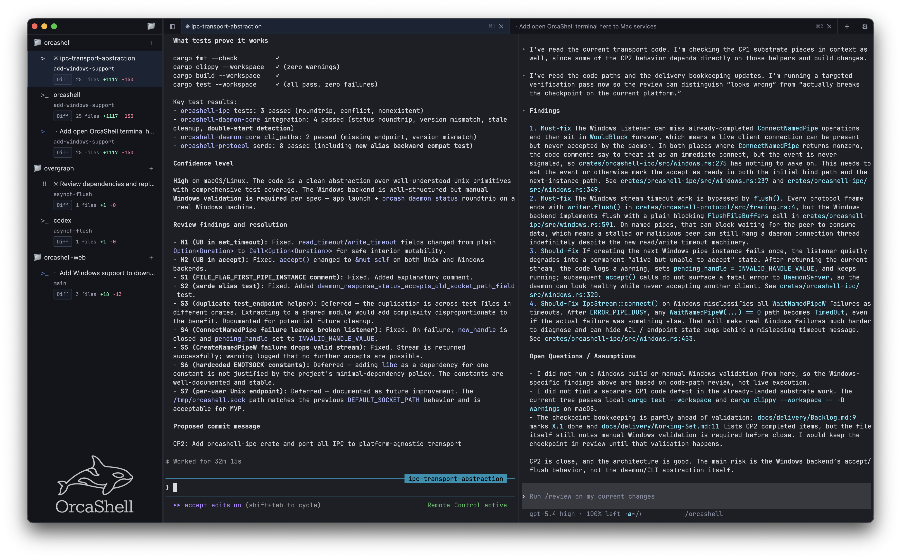
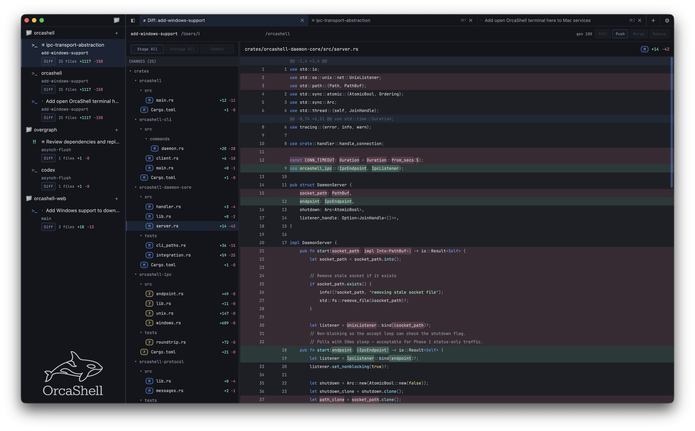

<p align="center">
<br><br><br>
<strong>A GPU-accelerated terminal built for agentic coding.</strong><br>
<strong>macOS, Linux, and Windows. Native splits, tabs, and multi-window. Built-in git with diff view, staging, worktrees, and push/pull.</strong><br>
<strong>Real-time notifications when your agents need you. Activity pulses so you always know what's running.</strong><br><br>
<a href="https://orcashell.com">orcashell.com</a>&nbsp;&nbsp;|&nbsp;&nbsp;<a href="LICENSE-MIT">MIT / Apache-2.0</a>
</p>

---

<p align="center">
  
</p>

<p align="center">
  
</p>

---

A professional, full-featured terminal built from the ground up for working alongside AI coding agents like Claude Code and Codex. The same experience on macOS, Linux, and Windows. GPU-rendered, stupid fast, and packed with features that actually make sense when your workflow involves multiple agents writing code at the same time.

I built it because I wanted a terminal that was genuinely good at agentic workflows, but also a top-of-the-line terminal I'd want to use for everything else too. Splits that remember where they were, worktrees that spin up in one click, diffs you can review and stage without switching apps, and notifications the second an agent needs attention.

It's written entirely in Rust on top of GPUI (the same GPU framework that powers the Zed editor). Every pixel is GPU-rendered. The terminal emulator is a customized fork of alacritty_terminal. State persists to SQLite so nothing is lost on restart. And it looks like nothing else.

## Highlights

**Agent notifications.** OrcaShell watches your terminal output for agent prompts. When Claude asks for approval or Codex needs a permission grant, you get a notification badge in the sidebar immediately. You stop missing prompts buried in 500 lines of scrollback. Configurable pattern matching so you decide what counts as urgent.

**Activity pulses.** Every terminal with active output shows a pulsing indicator. You can see at a glance which agents are working and which are idle without clicking through anything.

**Built-in diff explorer.** You didn't need a diff view inside your terminal until agents started writing code for you. Now you do. Two-pane layout with a file tree on the left and syntax-highlighted diffs on the right. Staged and unstaged sections. Highlights exactly what changed within each line, not just which lines changed. Multi-file batch staging, commit, push, pull, and merge-back. It's a real diff tool, not a toy.

**Managed worktrees.** Right-click a project, click "Create Worktree," and OrcaShell creates a git worktree with its own branch, opens a terminal in it, and tracks it in the sidebar. When you're done, merge it back or delete it. Every agent gets its own directory. No stepping on each other.

**Selection-delete.** Click into your shell input, highlight some text, and press delete. It just works. OrcaShell figures out the exact keystrokes needed to delete your selection in place using shell integration to track where your input region is. It makes the terminal input feel like a real text field. As far as I know, no other terminal does this.

**Remembers everything.** Quit and relaunch. Your windows are where you left them. Your splits are the same proportions. Your terminals reopened in the right directories with the right names. Projects, layouts, worktree associations, window positions and sizes. All of it persisted to SQLite. You set up your workspace once.

**GPU-accelerated rendering.** Built on GPUI, so everything is rendered on the GPU with intelligent batching. Only changed rows re-render. Adjacent cells with the same background merge into single draw calls. Box-drawing characters and block elements are rendered as GPU paths so they align perfectly regardless of your font. It's fast and it looks clean.

**Full-featured terminal.** This isn't a simplified terminal that trades features for a pretty UI. Kitty keyboard protocol, true color, five underline styles, regex search across your entire scrollback, programmatic box-drawing with rounded corners, double-width character support, bracketed paste, mouse reporting, and a custom pastel neon color palette. It's a complete terminal that happens to also be great for agents.

## Design

Dark mode with layered blue-black surfaces and subtle elevation through luminance shifts. No pure black, no pure white. Everything sits between soft greys and deep navies, orca-inspired, designed to be easy on your eyes for long sessions. Terminal colors use a pastel neon palette, bright enough to be functional and muted enough to stay pleasant. The goal was a workspace you actually want to spend hours in.

## Building from source

Requires Rust stable toolchain (2021 edition).

```bash
cargo build --workspace
cargo run -p orcashell
```

```bash
# Tests and linting
cargo test --workspace
cargo clippy --workspace -- -D warnings
cargo fmt --check
```

### Platforms

- **macOS** (ARM + Intel)
- **Linux**
- **Windows**

<details>
<summary><strong>Architecture</strong></summary>

OrcaShell is a Rust workspace with 10 crates:

```
crates/
  orcashell/                 # Desktop app entry point (GPUI)
  orcashell-ui/              # Workspace, sidebar, tab bar, diff explorer, settings
  orcashell-terminal-view/   # GPU terminal renderer, input, mouse, search, colors
  orcashell-session/         # PTY engine, shell integration, semantic zones
  orcashell-git/             # libgit2 wrapper: status, diff, stage, commit, worktrees
  orcashell-syntax/          # Syntax highlighting via syntect
  orcashell-daemon-core/     # Git coordinator, Unix socket server, worker threads
  orcashell-store/           # SQLite persistence (windows, projects, worktrees)
  orcashell-protocol/        # IPC framing and message types
  orcashell-cli/             # CLI client (orca command)

forks/
  alacritty_terminal/        # Forked with semantic prompt event support
  vte/                       # Forked with OSC 133 parsing
```

The UI is a client of the daemon core. It does not mutate git state or spawn processes directly. All git operations flow through the git coordinator's worker pool. The terminal emulator runs in its own session engine with a dedicated PTY reader thread. Rendering is decoupled from terminal state via frame snapshots.

</details>

## Contributing

Contributions welcome. See [CONTRIBUTING.md](CONTRIBUTING.md) for details.

```bash
git clone https://github.com/YOUR_USERNAME/orcashell.git
cd orcashell
cargo build --workspace
cargo test --workspace
```

## Acknowledgments

OrcaShell was built with help from excellent open source projects:

- **[gpui-terminal](https://github.com/zortax/gpui-terminal)** by Leonard Seibold. Used as the initial starting point for the terminal view crate. Core mouse reporting, color palette, and box-drawing utilities retain structure from the original. The majority has since been rewritten, but the early foundation was invaluable.
- **[Alacritty](https://github.com/alacritty/alacritty)** by the Alacritty Project. Both `alacritty_terminal` and `vte` are forked with semantic prompt support added.
- **[Zed](https://github.com/zed-industries/zed)** for GPUI, the GPU UI framework that makes all of this possible.

Full license details in [THIRD_PARTY_LICENSES](THIRD_PARTY_LICENSES).

## License

Licensed under either of

- [MIT License](LICENSE-MIT)
- [Apache License, Version 2.0](LICENSE-APACHE)

at your option.
